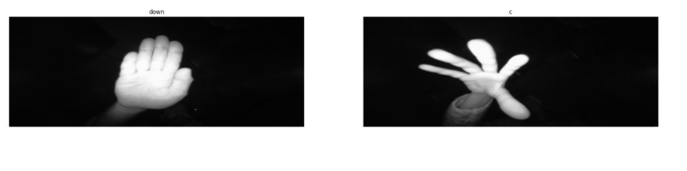
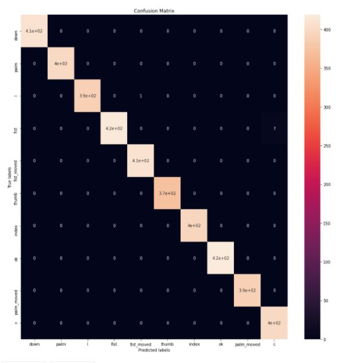

# Hand Sign Recognition
 
This project uses the [Hand Gesture Recognition Database](https://www.kaggle.com/gti-upm/leapgestrecog/version/1) (citation below) available on Kaggle. It contains 40000 images with different hands and hand gestures. There is a total of 10 hand gestures 

# Input 

# Output (confusion matrix)

